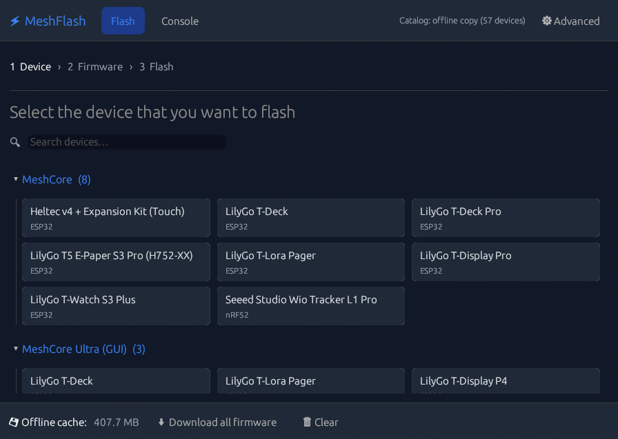

# MeshFlash

MeshFlash is a native desktop flasher for [MeshCore](https://meshcore.io)
firmware. It is a Rust/egui port of the official web flasher,
[flasher.meshcore.io](https://github.com/meshcore-dev/flasher.meshcore.io).



MeshFlash is one small binary. It does not need a browser or a server. It
downloads firmware release files directly from GitHub, and it keeps them in a
local cache. The device catalog is built into the binary, and MeshFlash gets a
newer copy from the official flasher site when it can.

MeshFlash can also work with no network at all. It can flash a file from the
cache, or a file that you select on your disk. Read
[Use MeshFlash without an internet connection](#use-meshflash-without-an-internet-connection).

MeshFlash is an independent community project. It is not an official MeshCore
tool. Report a MeshFlash problem here, not to the MeshCore team.

> **CAUTION: Before you flash an nRF52 device, learn how to recover it.** The
> nRF52 path has no hardware test yet. A failed flash stops the device until you
> recover it. The recovery steps are different for each device. Read question 6.7
> in the [MeshCore FAQ](https://github.com/meshcore-dev/MeshCore/blob/main/docs/faq.md)
> before you start.

## Status

Read this section before you flash a device.

| Part | Status |
|---|---|
| ESP32 flashing | Tested on hardware. A Heltec V4 (ESP32-S3, native USB) received the companion v1.16.0 merged image from the cache, and it started the new firmware without a reset by hand. |
| nRF52 flashing | **Not tested on hardware.** The CRC16, SLIP, and HCI framing code passes unit tests against the JavaScript reference. |
| Catalog and release merge | Checked by hand against the live data feeds. There are no automated tests yet. |

MeshFlash is built and used on Windows. The code has no Windows-only parts, so
it must also build on Linux and macOS. Nobody has tested those two platforms
yet. If you test one, please open an issue with the result.

## Features

- The same device catalog as the web flasher: 57 devices from Heltec, RAK,
  LilyGo, Seeed, and more. The catalog has three groups ("MeshCore", "MeshCore
  Ultra (GUI)", and "Community devices") and a search box.
- Firmware selection by function (companion BLE/USB, repeater, room server, GUI)
  and by version, with release notes.
- **ESP32** flashing with [espflash](https://github.com/esp-rs/espflash). An
  update writes at `0x10000`. A full wipe writes the merged image at `0x0`.
- **nRF52** flashing with legacy serial DFU (Adafruit bootloader). The SLIP/HCI
  protocol is a port of `dfu.js` from the web flasher. It includes the 1200-baud
  touch that puts the device in DFU mode, and the eraser packages for each
  device.
- A serial console for repeater and room server settings, with a clickable
  command list.
- A native serial-port selector that shows USB VID/PID data. For most devices,
  MeshFlash selects the correct port automatically.
- An offline cache manager: download all firmware in one step, cancel at any
  time, and clear the cache.
- Full offline operation. The catalog is built into the binary, and you can
  flash from the cache or from a file on your disk.

## Install

### Download a build

Get the binary for your platform from the [Releases](../../releases) page.
MeshFlash needs no installer. Put the file where you want it, then start it.

### Build from source

1. Install Rust 1.95 or newer with [rustup](https://rustup.rs).
2. On Linux, install the development packages first:
   `sudo apt install libudev-dev libgtk-3-dev`
3. Run this command in the project folder:

```
cargo build --release
```

The binary is `target/release/meshflash` (`meshflash.exe` on Windows).

## Flash a device

1. Connect the device with a USB cable.
2. Select the device in the catalog. Then select the firmware function.
3. ESP32 only: for a first install, select "First install / factory reset". For
   an update, select "Update".
4. Make sure that the correct serial port is selected.
5. Click **Flash**.

MeshFlash flashes the latest version by default. To get more controls, click
**⚙ Advanced** in the top bar. Advanced mode shows the version list, the button
for a custom file, and two nRF52 controls: the DFU mode checkbox and the flash
eraser.

If the device is already in DFU mode, open Advanced mode. Then clear the
checkbox "Enter DFU mode automatically".

## Set up a repeater or a room server

After you flash the device, open the *Console* tab. There you can set the name,
the frequency, and the location. The console uses USB serial at 115200 baud.

## Linux: give your user access to the serial port

On Linux, a normal user cannot open a serial port by default. MeshFlash then
shows a permission error.

1. Add your user to the `dialout` group: `sudo usermod -aG dialout $USER`
2. Log out, then log in again. The new group is active only after a new login.

Note: Some distributions use the `uucp` group instead of `dialout`.

## Where MeshFlash keeps its files

MeshFlash writes the firmware cache to the standard cache folder of the
platform:

| Platform | Folder |
|---|---|
| Windows | `%LOCALAPPDATA%\MeshFlash\firmware` |
| Linux | `~/.cache/MeshFlash/firmware` |
| macOS | `~/Library/Caches/MeshFlash/firmware` |

You can erase this folder at any time. Use the **🗑 Clear** button, or remove the
folder by hand. MeshFlash downloads each file again when it is necessary.

## Use MeshFlash without an internet connection

Three parts of MeshFlash work with no network:

- The device catalog is built into the binary. The device list and the version
  list always open, even on a computer that was never online.
- The firmware cache holds each file that you downloaded before.
- Advanced mode can flash a firmware file directly from your disk.

### Prepare the cache before you go offline

1. Connect the computer to the internet.
2. Click **⬇ Download all firmware** in the bottom bar.
3. Wait for the download to finish. You can click **✖ Cancel** at any time.

This step downloads the latest version of each firmware in the catalog. It does
not download older versions. To keep an older version, select it in Advanced
mode and flash it one time while you are online.

### Copy the cache from another computer

The cache holds normal files with their original names. So you can fill it by
hand, and MeshFlash then needs no network.

1. On a computer with an internet connection, download the firmware.
2. Copy the whole `firmware` folder to a USB stick.
3. On the offline computer, copy the files into the cache folder from the table
   above. Create the folder if it does not exist.

CAUTION: Make sure that each copied file is complete. MeshFlash does not compare
the file against a checksum. It flashes any file that is not empty.

### Flash a file from your disk

Use this method when the file is not in the catalog, or when you got it from
another source.

1. Click **⚙ Advanced** in the top bar.
2. Click **📄 Flash custom file…** in the bottom bar.
3. Select a `.bin` file for ESP32, or a `.zip` DFU package for nRF52.

## Contributing

Contributions are welcome. Read [CONTRIBUTING.md](CONTRIBUTING.md) first. It
gives the build steps, the checks to run, and the hardware test that a flashing
change needs.

The nRF52 path needs help most, because it has no hardware test yet.

## Credits

MeshFlash builds on the work of these projects:

- **[flasher.meshcore.io](https://github.com/meshcore-dev/flasher.meshcore.io)**
  by Rastislav Vysoky (MIT) — the foundation of this project. MeshFlash ports
  its nRF52 DFU code, uses its curated device catalog, and follows its flash
  procedures. Without it, this tool would not exist.
- **[adafruit-nrfutil](https://github.com/adafruit/Adafruit_nRF52_nrfutil)** —
  the origin of the nRF52 serial DFU protocol (a fork of Nordic pc-nrfutil).
- **[espflash](https://github.com/esp-rs/espflash)** by the esp-rs team —
  powers all ESP32 flashing.
- **[egui](https://github.com/emilk/egui)** by Emil Ernerfeldt — the UI toolkit.
- The **[MeshCore](https://meshcore.io)** project itself, for the firmware
  and the ecosystem that make all of this useful.

## License

MIT. See [LICENSE](LICENSE).

The catalog data and the ported protocol code keep the copyright of their
original authors. [THIRD_PARTY_NOTICES.md](THIRD_PARTY_NOTICES.md) names the
derived parts and holds the full license texts. Keep that file with each
distribution.
